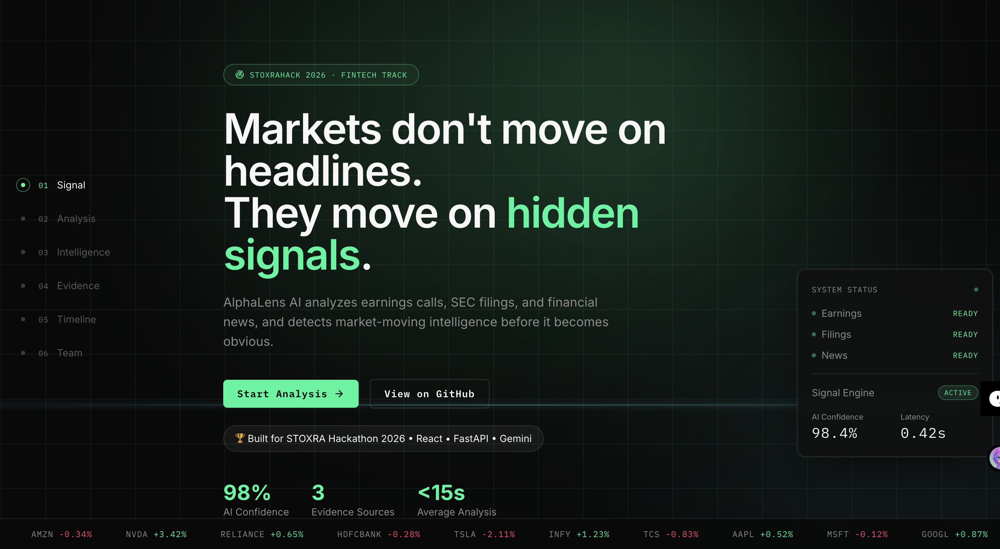

<p align="center">
  
</p>

<h1 align="center">🚀 AlphaLens AI</h1>

<p align="center">
  <strong>AI-Powered Financial Intelligence Platform</strong><br>
  Markets don't move on headlines. They move on hidden signals.
</p>

<p align="center">


</p>

<p align="center">
<a href="https://alpha-lens-ai-eta.vercel.app"><strong>🌐 Live Demo</strong></a>
&nbsp;&nbsp;•&nbsp;&nbsp;
<a href="https://alphalens-backend-t8ky.onrender.com"><strong>⚙️ Backend API</strong></a>
</p>

---

# 📖 Overview

**AlphaLens AI** is an AI-powered financial intelligence platform that transforms **earnings calls**, **SEC filings**, and **financial news** into explainable investment insights.

Instead of summarizing information, AlphaLens detects hidden market signals, assigns confidence scores, highlights supporting evidence, and presents everything through an interactive intelligence dashboard.

Built for **STOXRA Hackathon 2026 – FinTech Track**.

---

# ✨ Features

- 📈 AI-powered financial signal detection
- 📰 Multi-source intelligence analysis
- 🧠 Explainable AI insights
- 🎯 Confidence scoring engine
- 📑 Evidence-backed reports
- ⚡ Interactive analysis workflow
- 📊 Intelligence dashboard
- 🌙 Modern responsive UI
- 🚀 FastAPI + React architecture

---

# 🏗️ Architecture

```text
                Earnings Calls
                      │
                SEC Filings
                      │
               Financial News
                      │
                      ▼
              AlphaLens AI Engine
                      │
      ┌───────────────┼───────────────┐
      │               │               │
 Signal Detection  Confidence AI  Evidence Mapping
                      │
                      ▼
          Interactive Intelligence Dashboard
```

---

# 🛠️ Tech Stack

| Category | Technologies |
|-----------|--------------|
| Frontend | React 19, TypeScript, Vite, Tailwind CSS, Framer Motion |
| Backend | FastAPI, Python 3.11, Pydantic |
| AI | Google Gemini |
| Deployment | Vercel, Render |
| Version Control | Git & GitHub |

---

# 📂 Project Structure

```text
AlphaLens-AI
│
├── backend
│   ├── app
│   ├── requirements.txt
│   └── runtime.txt
│
├── frontend
│   ├── src
│   ├── public
│   └── package.json
│
├── screenshot
│   └── Hero.png
│
└── README.md
```

---

# 🚀 Getting Started

## Clone Repository

```bash
git clone https://github.com/techAsmita/AlphaLens-AI.git

cd AlphaLens-AI
```

---

## Backend Setup

```bash
cd backend

python -m venv .venv

source .venv/bin/activate      # macOS/Linux

pip install -r requirements.txt

uvicorn app.main:app --reload
```

Backend runs at

```
http://localhost:8000
```

---

## Frontend Setup

```bash
cd frontend

npm install

npm run dev
```

Frontend runs at

```
http://localhost:5173
```

---

# 🌐 Deployment

| Service | Platform |
|----------|----------|
| Frontend | Vercel |
| Backend | Render |

Frontend

```
https://alpha-lens-ai-eta.vercel.app
```

Backend

```
https://alphalens-backend-t8ky.onrender.com
```

---

# 🔮 Roadmap

- 📈 Live Market Data
- 🤖 AI Investment Copilot
- 📊 Portfolio Monitoring
- 📑 PDF Intelligence Reports
- 🔍 Multi-company Comparison
- 🔔 Real-time Market Alerts

---

# 👤 Developer

### Asmita Roy

Computer Engineering Student • AI Engineer • Full Stack Developer

- GitHub: https://github.com/techAsmita
- LinkedIn: https://www.linkedin.com/in/techasmita/

---

# ⭐ Support

If you enjoyed this project, consider giving it a ⭐ on GitHub.

It helps the project reach more developers.

---

<p align="center">

Built with ❤️ using React, FastAPI and Google Gemini.

</p>
